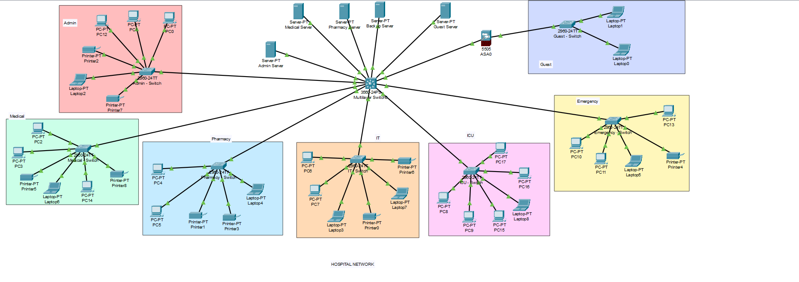
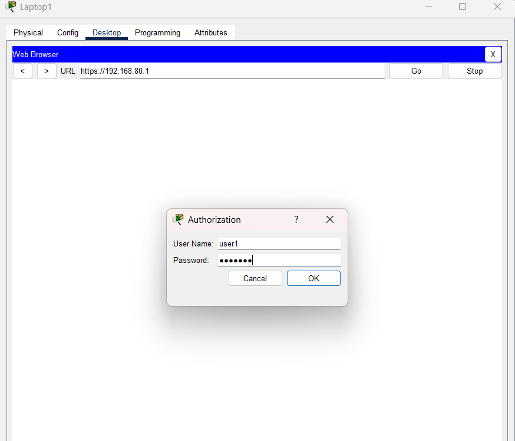

## Network Topology Preview

The following diagram shows the logical structure of the hospital network, divided into VLANs for each department:

## SSL VPN Access Preview

Remote users (e.g., guests or off-site staff) can securely log in via a web-based SSL VPN using their credentials:

# Hospital Network Simulation using Cisco Packet Tracer

This project simulates a secure, multi-department hospital network using **Cisco Packet Tracer**. It demonstrates VLAN configuration, Inter-VLAN routing, DHCP, OSPF routing, and secure remote access via SSL VPN.

## Files Included

- `Hospital_Network.pkt` – The full network simulation file.
- `Cisco Packet Tracer.docx` – Detailed step-by-step network configuration guide.

## Network Overview

The network is structured into the following departments, each assigned a unique VLAN:

- **Admin** – VLAN 10
- **Medical** – VLAN 20
- **Pharmacy** – VLAN 30
- **IT** – VLAN 40
- **Emergency** – VLAN 50
- **Guests** – VLAN 60

Each department is provided with:
- Dynamic IP allocation through a DHCP pool.
- Logical separation via VLANs.
- Internal communication enabled by Inter-VLAN routing.

## Key Configurations

### VLAN & DHCP
Each VLAN is configured with:
- A unique subnet (e.g., 192.168.10.0/24 for Admin).
- A DHCP pool with excluded IPs and DNS settings.

### Inter-VLAN Routing
- Performed on the **core switch** using Layer 3 interfaces.
- `ip routing` enabled to allow cross-VLAN communication.

### OSPF Routing
- OSPF is configured on the core switch to advertise all VLAN networks in Area 0.

### Trunk Links
- Trunk ports are configured between the core and access switches to carry VLAN traffic.

### SSL VPN Access
- A separate network (192.168.80.0/24) is configured with a **firewall** and **VPN server**.
- Remote users can securely access internal services using a web-based VPN login (via `https://192.168.80.1`).

## Additional Elements

- **Departmental Servers**: Each department has its own server (e.g., 192.168.X.100) connected through respective VLANs.
- **User Authentication**: VPN access includes user credentials (`user1 / 123PESU`) and personalized bookmarks for server access.

## How to Use

1. Open `Hospital_Network.pkt` using **Cisco Packet Tracer (v8.x or higher)**.
2. Review and explore configurations by entering CLI mode on the core switch and firewall.
3. Use the guide in `Cisco Packet Tracer.docx` to understand step-by-step commands.
4. Test connectivity and simulate real-world network scenarios (e.g., VPN login, DHCP allocation, inter-VLAN ping).

## Notes

- Ensure Cisco Packet Tracer is installed before opening `.pkt` files.
- Configurations are designed for educational and demonstration purposes.

## 📜 License

This project is provided for academic use only. You are free to clone and modify it for your own learning or demonstration purposes.
